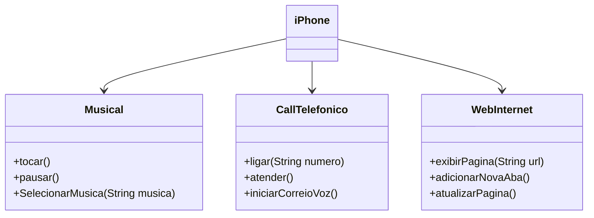

# Diagrama de Classes - iPhone

```mermaid
classDiagram
    class Musical {
        +tocar()
        +pausar()
        +SelecionarMusica(String musica)
    }

    class CallTelefonico {
        +ligar(String numero)
        +atender()
        +iniciarCorreioVoz()
    }

    class WebInternet {
        +exibirPagina(String url)
        +adicionarNovaAba()
        +atualizarPagina()
    }

    class iPhone {
    }

    iPhone --> Musical
    iPhone --> CallTelefonico
    iPhone --> WebInternet
```
---
[Repositorio referente ao Desafio]("https://github.com/digitalinnovationone/trilha-java-basico/blob/main/desafios/poo/README.md")